<p align="center">
  
</p>

<p align="center">
  <strong>Define AI agent systems declaratively using ACP native schema</strong>
</p>

<p align="center">
  Think <em>Infrastructure as Code</em>, but for AI agents
</p>

<br />

<p align="center">
  <a href="https://pypi.org/project/acp-cli/"></a>
  <a href="https://pypi.org/project/acp-cli/"></a>
  <a href="LICENSE"></a>
  <a href="#"></a>
</p>

---

## Table of Contents

- [Why ACP?](#why-acp)
- [Installation](#installation)
  - [Quick Install (Recommended)](#quick-install-recommended)
  - [Verify Installation](#verify-installation)
- [Quick Start](#quick-start)
- [Features](#features)
- [Architecture](#architecture)
- [Examples](#examples)
- [Modules](#modules)
  - [Using Modules](#using-modules)
  - [Creating Modules](#creating-modules)
  - [Module Source Formats](#module-source-formats)
  - [Module Caching](#module-caching)
- [CLI Reference](#cli-reference)
- [Contributing](#contributing)
  - [Development Setup](#development-setup)
  - [Project Structure](#project-structure)
- [License](#license)

---

## Why ACP?

Most AI agent frameworks require you to write imperative code - managing state, handling retries, wiring up tools. ACP takes a different approach: **describe your agents declaratively in ACP native schema, and let the runtime engine handle the rest.**

```hcl
agent "reviewer" {
  model        = model.gpt4o
  instructions = "Review code for security issues"
  allow        = [capability.read_file, capability.get_diff]
  policy       = policy.strict
}
```

**The result:** Your agent configurations become version-controlled artifacts that are easy to review, share, and reproduce. The native `.acp` format provides type safety, explicit references, and improved editor support.

<br />

## Installation

### Quick Install (Recommended)

```bash
pip install acp-cli
```

That's it! You're ready to go.


### Verify Installation

```bash
acp --help
```

<br />

## Quick Start

### 1. Set up your API key

```bash
export OPENAI_API_KEY="your-openai-key"
```

### 2. Create an agent spec

Create a file called `my-agent.acp`:

```hcl
acp {
  version = "0.1"
  project = "my-first-agent"
}

variable "openai_api_key" {
  type        = string
  description = "OpenAI API key"
  sensitive   = true
}

provider "llm.openai" "default" {
  api_key = var.openai_api_key
  default_params {
    temperature = 0.7
    max_tokens  = 2000
  }
}

policy "default" {
  budgets { max_cost_usd_per_run = 0.50 }
  budgets { timeout_seconds = 60 }
}

model "gpt4o_mini" {
  provider = provider.llm.openai.default
  id       = "gpt-4o-mini"
}

model "gpt4o" {
  provider = provider.llm.openai.default
  id       = "gpt-4o"
}

agent "assistant" {
  model           = model.gpt4o_mini
  fallback_models = [model.gpt4o]

  instructions = "You are a helpful assistant. Answer questions clearly and concisely."

  policy = policy.default
}

workflow "ask" {
  entry = step.process

  step "process" {
    type  = "llm"
    agent = agent.assistant

    input { question = input.question }

    output "answer" { from = result.text }

    next = step.end
  }

  step "end" { type = "end" }
}
```

### 3. Run it

```bash
# Validate your spec
acp validate my-agent.acp

# Run with input
acp run ask --spec my-agent.acp --input '{"question": "What is the capital of France?"}'
```

<br />

## Features

| Feature | Description |
|---------|-------------|
| **Native Schema** | Define agents, workflows, and policies in type-safe `.acp` format with explicit references |
| **Modules** | Terraform-style reusable modules for sharing agent configurations via Git |
| **Multi-Provider** | Use OpenAI, Anthropic, or other LLM providers interchangeably |
| **Multi-Agent** | Coordinate multiple specialized agents with conditional routing |
| **MCP Integration** | Connect to external tools via Model Context Protocol servers |
| **Policy Enforcement** | Set budgets, timeouts, and capability limits per agent |
| **Human-in-the-Loop** | Built-in approval gates for sensitive operations |
| **Execution Tracing** | Full visibility into workflow execution for debugging |

<br />

## Architecture

ACP is built as a modular system with five core packages:

```mermaid
flowchart TB
    subgraph User["User Layer"]
        ACP["📄 .acp Spec"]
        CLI["⚡ acp-cli"]
        ACP --> CLI
    end

    subgraph Core["Core Layer"]
        SCHEMA["📦 acp-schema"]
        COMPILER["🔧 acp-compiler"]
        RUNTIME["🚀 acp-runtime"]
        COMPILER --> SCHEMA
        COMPILER --> RUNTIME
    end

    subgraph Integration["Integration Layer"]
        MCP["🔌 acp-mcp"]
        LLM["🧠 LLM Providers"]
        TOOLS["🛠️ External Tools"]
    end

    CLI --> COMPILER
    RUNTIME --> MCP
    RUNTIME --> LLM
    MCP --> TOOLS
```



| Package | Description |
|---------|-------------|
| **acp-schema** | Core Pydantic models for specs and Intermediate Representation |
| **acp-compiler** | Parses `.acp` files, validates specs, and generates IR for the runtime |
| **acp-runtime** | Workflow execution engine with LLM integration and policy enforcement |
| **acp-mcp** | MCP (Model Context Protocol) client for connecting to external tool servers |
| **acp-cli** | Command-line interface for validating and running workflows |

<br />

## Examples

The [`examples/`](examples/) directory contains ready-to-use configurations demonstrating various ACP features. Each example includes detailed documentation explaining the concepts it covers.

**[Browse all examples →](examples/)**

Quick start with the simplest example:

```bash
cd examples/simple-agent
acp run ask --var openai_api_key=$OPENAI_API_KEY --input '{"question": "Hello!"}'
```

<br />

## Modules

ACP supports a **Terraform-style module system** for creating reusable, shareable agent configurations. Modules let you package providers, policies, agents, and workflows together, making it easy for others to use without extensive configuration.

### Using Modules

#### 1. Import a module in your project

Create a module block referencing a Git repository:

```hcl
module "pr-reviewer" {
  source  = "github.com/org/acp-modules//pr-reviewer"
  version = "v1.0.0"  // Git branch, tag, or commit
  
  // Pass required parameters
  api_key = var.openai_api_key
  model   = "gpt-4o"
}
```

The `//` syntax separates the repository URL from the subdirectory path (like Terraform).

#### 2. Initialize your project

Download all external modules to your local `.acp/modules/` directory:

```bash
acp init
```

This clones the module repositories locally. You must run `acp init` before compiling or running workflows that use external modules.

#### 3. Use module resources

Resources from modules are namespaced with `module.<name>`:

```hcl
workflow "review" {
  entry = step.start
  
  step "start" {
    type  = "llm"
    agent = agent.module.pr-reviewer.reviewer  // Use module's agent
    next  = step.end
  }
  
  step "end" { type = "end" }
}
```

Or run a module's workflow directly:

```bash
acp run module.pr-reviewer.review_workflow .
```

### Creating Modules

A module is simply a directory containing `.acp` files. To create a shareable module:

#### 1. Create the module structure

```
my-module/
├── 00-project.acp      # Module metadata
├── 01-variables.acp    # Input parameters (variables)
├── 02-providers.acp    # LLM providers
├── 03-policies.acp     # Policies
├── 04-models.acp       # Model configurations
├── 05-agents.acp       # Agent definitions
└── 06-workflows.acp    # Workflows (optional)
```

#### 2. Define input variables

Variables without defaults become required parameters:

```hcl
// 01-variables.acp
variable "api_key" {
  type        = string
  description = "API key for the LLM provider"
  sensitive   = true
  // No default = required parameter
}

variable "model" {
  type        = string
  description = "Model to use"
  default     = "gpt-4o-mini"  // Has default = optional
}
```

#### 3. Publish to Git

Push your module to a Git repository. Users can then reference it:

```hcl
module "my-module" {
  source  = "github.com/your-org/your-repo//path/to/module"
  version = "main"
  
  api_key = var.my_api_key
}
```

### Module Source Formats

| Format | Example |
|--------|---------|
| GitHub | `github.com/org/repo` |
| GitHub with subdirectory | `github.com/org/repo//modules/my-module` |
| GitLab | `gitlab.com/org/repo` |
| Local path | `./modules/my-module` |

### Module Caching

Modules are cached in `.acp/modules/` within your project directory:

```
my-project/
├── .acp/
│   └── modules/
│       └── github_com_org_repo_abc123/  # Cached module
├── 00-project.acp
└── 01-modules.acp
```

Add `.acp/` to your `.gitignore` - these are downloaded dependencies.

<br />

## CLI Reference

```bash
# Initialize project - download external modules
acp init [directory]

# Validate a specification
acp validate <spec-file>

# Compile to IR (Intermediate Representation) - useful for debugging
acp compile <spec-file> [--output output.json]

# Run a workflow
acp run <workflow-name> [options]

Options:
  -s, --spec PATH        Path to .acp spec file (default: acp.acp)
  -i, --input JSON       Input data as JSON string
  -f, --input-file PATH  Input data from JSON file
  -o, --output PATH      Write output to file
  -t, --trace PATH       Write execution trace to file
  -v, --verbose          Enable verbose output
```

<br />

---

<br />

## Contributing

We welcome contributions! Whether it's bug fixes, new features, or documentation improvements.

### Development Setup

#### Prerequisites

- Python 3.12 or higher
- [Poetry](https://python-poetry.org/) for dependency management

#### Clone and Install

```bash
# Clone the repository
git clone https://github.com/acp-team/acp.git
cd acp

# Install all packages in development mode
cd acp-schema && poetry install && cd ..
cd acp-mcp && poetry install && cd ..
cd acp-compiler && poetry install && cd ..
cd acp-runtime && poetry install && cd ..
cd acp-cli && poetry install && cd ..
```

#### Running Tests

```bash
# Run tests for a specific package
cd acp-runtime
poetry run pytest

# Run with coverage
poetry run pytest --cov=acp_runtime
```

### Project Structure

```
acp/
├── acp-schema/      # Core data models
├── acp-compiler/    # ACP parser and validator
├── acp-runtime/     # Workflow execution engine
├── acp-mcp/         # MCP client integration
├── acp-cli/         # Command-line interface
└── examples/        # Example configurations (.acp format)
```

## License

This project is licensed under the Apache License 2.0 - see the [LICENSE](LICENSE) file for details.

<br />

---

<p align="center">
  <sub>Built with ❤️ for the AI agent community</sub>
</p>


