<p align="center">
  
</p>

<p align="center">
  <strong>Define AI agent systems declaratively using ACP native schema</strong>
</p>

<p align="center">
  Think <em>Infrastructure as Code</em>, but for AI agents
</p>

<br />

<p align="center">
  <a href="https://pypi.org/project/acp-cli/"></a>
  <a href="https://pypi.org/project/acp-cli/"></a>
  <a href="LICENSE"></a>
  <a href="#"></a>
</p>

<br />

---

<br />

## Why ACP?

Most AI agent frameworks require you to write imperative code - managing state, handling retries, wiring up tools. ACP takes a different approach: **describe your agents declaratively in ACP native schema, and let the runtime engine handle the rest.**

```hcl
agent "reviewer" {
  model        = model.gpt4o
  instructions = "Review code for security issues"
  allow        = [capability.read_file, capability.get_diff]
  policy       = policy.strict
}
```

**The result:** Your agent configurations become version-controlled artifacts that are easy to review, share, and reproduce. The native `.acp` format provides type safety, explicit references, and improved editor support.

<br />

## Installation

### Quick Install (Recommended)

```bash
pip install acp-cli
```

That's it! You're ready to go.

### VS Code Extension (Optional)

For syntax highlighting and code snippets in VS Code, install the [ACP VS Code extension](https://github.com/acp-team/acp-vscode):

```bash
# From source
git clone https://github.com/acp-team/acp-vscode.git
cp -r acp-vscode ~/.vscode/extensions/acp-language
```

Or install from the VS Code marketplace (coming soon).

### Verify Installation

```bash
acp --help
```

<br />

## Quick Start

### 1. Set up your API key

```bash
export OPENAI_API_KEY="your-openai-key"
```

### 2. Create an agent spec

Create a file called `my-agent.acp`:

```hcl
acp {
  version = "0.1"
  project = "my-first-agent"
}

provider "llm.openai" "default" {
  api_key = env("OPENAI_API_KEY")
  default_params {
    temperature = 0.7
    max_tokens  = 2000
  }
}

policy "default" {
  budgets { max_cost_usd_per_run = 0.50 }
  budgets { timeout_seconds = 60 }
}

model "gpt4o_mini" {
  provider = provider.llm.openai.default
  id       = "gpt-4o-mini"
}

model "gpt4o" {
  provider = provider.llm.openai.default
  id       = "gpt-4o"
}

agent "assistant" {
  model           = model.gpt4o_mini
  fallback_models = [model.gpt4o]

  instructions = "You are a helpful assistant. Answer questions clearly and concisely."

  policy = policy.default
}

workflow "ask" {
  entry = step.process

  step "process" {
    type  = "llm"
    agent = agent.assistant

    input { question = input.question }

    output "answer" { from = result.text }

    next = step.end
  }

  step "end" { type = "end" }
}
```

### 3. Run it

```bash
# Validate your spec
acp validate my-agent.acp

# Run with input
acp run ask --spec my-agent.acp --input '{"question": "What is the capital of France?"}'
```

<br />

## Features

| Feature | Description |
|---------|-------------|
| **Native Schema** | Define agents, workflows, and policies in type-safe `.acp` format with explicit references |
| **Multi-Provider** | Use OpenAI, Anthropic, or other LLM providers interchangeably |
| **Multi-Agent** | Coordinate multiple specialized agents with conditional routing |
| **MCP Integration** | Connect to external tools via Model Context Protocol servers |
| **Policy Enforcement** | Set budgets, timeouts, and capability limits per agent |
| **Human-in-the-Loop** | Built-in approval gates for sensitive operations |
| **Execution Tracing** | Full visibility into workflow execution for debugging |

<br />

## Architecture

ACP is built as a modular system with five core packages:

```mermaid
flowchart TB
    subgraph User["User Layer"]
        ACP["📄 .acp Spec"]
        CLI["⚡ acp-cli"]
        ACP --> CLI
    end

    subgraph Core["Core Layer"]
        SCHEMA["📦 acp-schema"]
        COMPILER["🔧 acp-compiler"]
        RUNTIME["🚀 acp-runtime"]
        COMPILER --> SCHEMA
        COMPILER --> RUNTIME
    end

    subgraph Integration["Integration Layer"]
        MCP["🔌 acp-mcp"]
        LLM["🧠 LLM Providers"]
        TOOLS["🛠️ External Tools"]
    end

    CLI --> COMPILER
    RUNTIME --> MCP
    RUNTIME --> LLM
    MCP --> TOOLS
```



| Package | Description |
|---------|-------------|
| **acp-schema** | Core Pydantic models for specs and Intermediate Representation |
| **acp-compiler** | Parses `.acp` files, validates specs, and generates IR for the runtime |
| **acp-runtime** | Workflow execution engine with LLM integration and policy enforcement |
| **acp-mcp** | MCP (Model Context Protocol) client for connecting to external tool servers |
| **acp-cli** | Command-line interface for validating and running workflows |

<br />

## Examples

The `examples/` directory contains ready-to-use configurations (all in `.acp` format):

### Simple Agent

A basic question-answering agent:

```bash
acp run ask --spec examples/simple-agent/spec.acp --input '{"question": "Hello!"}'
```

### Filesystem Agent

An agent that can read, write, and analyze files using MCP:

```bash
acp run read_and_summarize --spec examples/filesystem-agent/spec.acp \
  --input '{"file_path": "/path/to/file.txt", "task": "Summarize this file"}'
```

### Multi-Agent Router

Conditional routing between agents based on task complexity:

```bash
acp run smart_respond --spec examples/multi-agent/spec.acp \
  --input '{"task": "Explain quantum computing"}'
```

<br />

## CLI Reference

```bash
# Validate a specification
acp validate <spec-file>

# Compile to IR (Intermediate Representation) - useful for debugging
acp compile <spec-file> [--output output.json]

# Run a workflow
acp run <workflow-name> [options]

Options:
  -s, --spec PATH        Path to .acp spec file (default: acp.acp)
  -i, --input JSON       Input data as JSON string
  -f, --input-file PATH  Input data from JSON file
  -o, --output PATH      Write output to file
  -t, --trace PATH       Write execution trace to file
  -v, --verbose          Enable verbose output
```

<br />

---

<br />

## Contributing

We welcome contributions! Whether it's bug fixes, new features, or documentation improvements.

### Development Setup

#### Prerequisites

- Python 3.12 or higher
- [Poetry](https://python-poetry.org/) for dependency management

#### Clone and Install

```bash
# Clone the repository
git clone https://github.com/acp-team/acp.git
cd acp

# Install all packages in development mode
cd acp-schema && poetry install && cd ..
cd acp-mcp && poetry install && cd ..
cd acp-compiler && poetry install && cd ..
cd acp-runtime && poetry install && cd ..
cd acp-cli && poetry install && cd ..
```

#### Running Tests

```bash
# Run tests for a specific package
cd acp-runtime
poetry run pytest

# Run with coverage
poetry run pytest --cov=acp_runtime
```

### Project Structure

```
acp/
├── acp-schema/      # Core data models
├── acp-compiler/    # ACP parser and validator
├── acp-runtime/     # Workflow execution engine
├── acp-mcp/         # MCP client integration
├── acp-cli/         # Command-line interface
└── examples/        # Example configurations (.acp format)

acp-vscode/          # VS Code extension (separate repo)
└── syntaxes/        # TextMate grammar for syntax highlighting
```

## License

This project is licensed under the MIT License - see the [LICENSE](LICENSE) file for details.

<br />

---

<p align="center">
  <sub>Built with ❤️ for the AI agent community</sub>
</p>
