# Agentform Architecture

Agentform is built as a modular system with five core packages, each with a specific responsibility.

## System Overview

```mermaid
flowchart TB
    subgraph User["User Layer"]
        Agentform["📄 .agentform Spec"]
        CLI["⚡ agentform-cli"]
        Agentform --> CLI
    end

    subgraph Core["Core Layer"]
        SCHEMA["📦 agentform-schema"]
        COMPILER["🔧 agentform-compiler"]
        RUNTIME["🚀 agentform-runtime"]
        COMPILER --> SCHEMA
        COMPILER --> RUNTIME
    end

    subgraph Integration["Integration Layer"]
        MCP["🔌 agentform-mcp"]
        LLM["🧠 LLM Providers"]
        TOOLS["🛠️ External Tools"]
    end

    CLI --> COMPILER
    RUNTIME --> MCP
    RUNTIME --> LLM
    MCP --> TOOLS
```



## Core Packages

| Package | Description |
|---------|-------------|
| **agentform-schema** | Core Pydantic models for specs and Intermediate Representation |
| **agentform-compiler** | Parses `.agentform` files, validates specs, and generates IR for the runtime |
| **agentform-runtime** | Workflow execution engine with LLM integration and policy enforcement |
| **agentform-mcp** | MCP (Model Context Protocol) client for connecting to external tool servers |
| **agentform-cli** | Command-line interface for validating and running workflows |

## Package Details

### agentform-schema

The foundation of Agentform, providing:
- Type-safe data models for all Agentform constructs
- Intermediate Representation (IR) schema
- Validation rules and constraints

**Key Components:**
- `models.py`: Core data models (agents, workflows, policies, etc.)
- `ir.py`: Intermediate Representation schema
- `version.py`: Version management

### agentform-compiler

Transforms `.agentform` files into executable IR:

1. **Parsing**: Converts HCL-like syntax to Abstract Syntax Tree (AST)
2. **Normalization**: Resolves references and applies defaults
3. **Validation**: Ensures type safety and constraint satisfaction
4. **IR Generation**: Produces the Intermediate Representation

**Key Components:**
- `agentform_parser.py`: Parses `.agentform` files
- `agentform_resolver.py`: Resolves references and dependencies
- `agentform_validator.py`: Validates configurations
- `ir_generator.py`: Generates IR from validated AST
- `agentform_module_loader.py`: Loads external modules

### agentform-runtime

Executes workflows defined in the IR:

1. **State Management**: Tracks workflow execution state
2. **Step Execution**: Executes individual workflow steps
3. **LLM Integration**: Calls LLM providers for `llm` steps
4. **Policy Enforcement**: Enforces budgets, timeouts, and capability limits
5. **Tracing**: Records execution traces for debugging

**Key Components:**
- `engine.py`: Main workflow execution engine
- `state.py`: State management
- `llm.py`: LLM provider integration
- `policy.py`: Policy enforcement
- `tracing.py`: Execution tracing
- `approval.py`: Human-in-the-loop approval

### agentform-mcp

Connects Agentform to external tools via Model Context Protocol:

1. **MCP Client**: Communicates with MCP servers
2. **Capability Mapping**: Maps MCP tools to Agentform capabilities
3. **Server Management**: Manages connections to multiple MCP servers

**Key Components:**
- `client.py`: MCP client implementation
- `server.py`: Server connection management
- `types.py`: MCP type definitions

### agentform-cli

Provides the command-line interface:

1. **Command Parsing**: Parses CLI arguments
2. **Orchestration**: Coordinates compiler and runtime
3. **Output Formatting**: Formats results for display

**Key Components:**
- `main.py`: CLI entry point
- `commands/`: Individual command implementations
  - `init.py`: Module initialization
  - `validate.py`: Validation command
  - `compile.py`: Compilation command
  - `run.py`: Workflow execution

## Data Flow

### Compilation Flow

```
.agentform files
    ↓
[Parser] → AST
    ↓
[Resolver] → Resolved AST
    ↓
[Validator] → Validated AST
    ↓
[IR Generator] → IR JSON
```

### Execution Flow

```
IR JSON
    ↓
[Runtime Engine] → Workflow State
    ↓
[Step Executor] → Step Results
    ↓
[LLM/MCP Integration] → External Calls
    ↓
[Policy Enforcement] → Constraint Checks
    ↓
[Output] → Final Results
```

## Extension Points

### Adding LLM Providers

1. Implement provider interface in `agentform-runtime`
2. Add provider type to schema
3. Update compiler to recognize new provider

### Adding Step Types

1. Define step type in schema
2. Implement step executor in runtime
3. Update compiler validation

### Adding Capabilities

1. Connect MCP server via `agentform-mcp`
2. Define capabilities in `.agentform` files
3. Use in workflows via `call` steps

## Design Principles

1. **Separation of Concerns**: Each package has a single, well-defined responsibility
2. **Type Safety**: Extensive use of Pydantic for runtime type checking
3. **Extensibility**: Clear interfaces for adding providers, steps, and capabilities
4. **Declarative**: Users describe what they want, not how to achieve it
5. **Observability**: Built-in tracing and logging throughout
